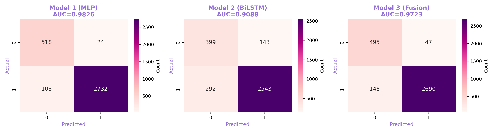
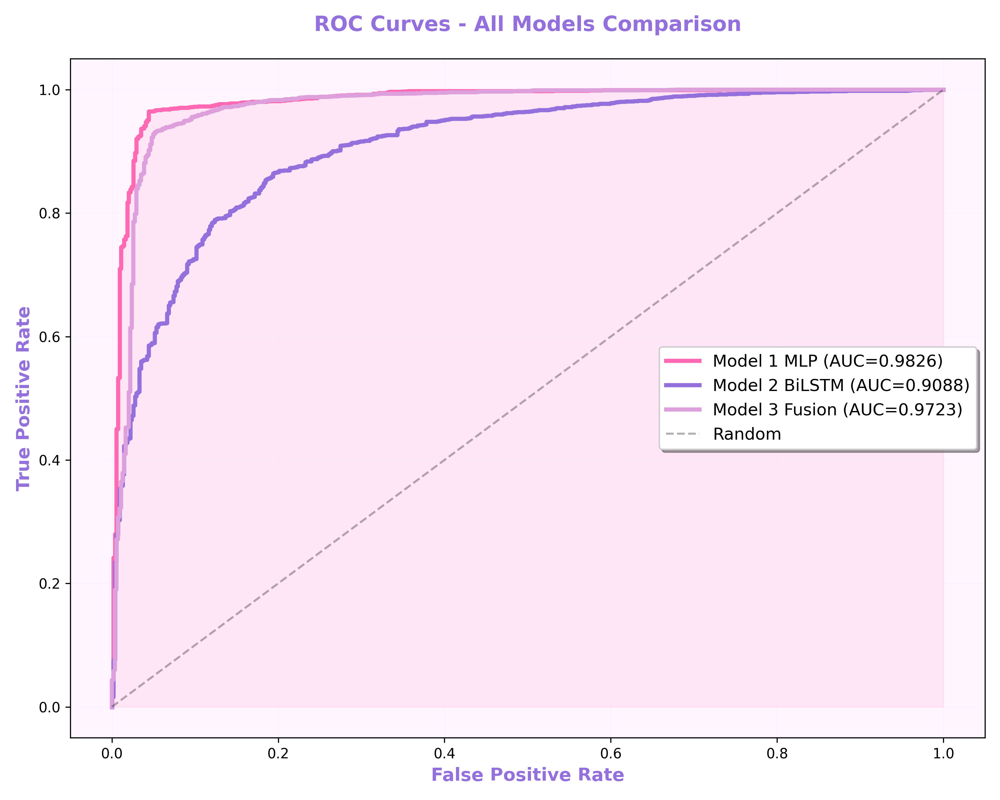
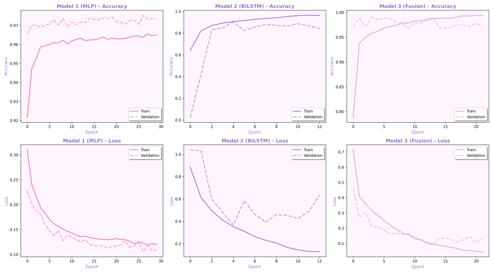

# Sephora Product Recommendation Prediction
**Multi-Modal Deep Learning for Cosmetics Review Classification**

## Opis problemu

Projekt rozwiązuje problem **klasyfikacji binarnej** recenzji produktów kosmetycznych:
- **Klasa 1**: Użytkownik poleca produkt (`is_recommended = 1`)
- **Klasa 0**: Użytkownik nie poleca produktu (`is_recommended = 0`)

### Motywacja
W branży kosmetycznej generowane są miliony recenzji rocznie. Automatyczna klasyfikacja sentymentu pozwala na:
- Szybką identyfikację produktów polecanych przez użytkowników
- Wsparcie decyzji zakupowych konsumentów
- Analizę trendów i preferencji klientów

### Wyzwania
- **Niezrównoważenie klas**: 84% pozytywnych recenzji
- **Multi-modal data**: Tekst recenzji + cechy strukturalne (rating, price)
- **Semantic ambiguity**: Pozytywny język ≠ rekomendacja

---

## Dataset

**Źródło**: [Kaggle - Sephora Products and Skincare Reviews]((https://www.kaggle.com/datasets/nadyinky/sephora-products-and-skincare-reviews?resource=download))

**Statystyki**:
- ~1,000,000 recenzji produktów kosmetycznych
- W projekcie: **20,000 próbek** (sample dla szybkości)
- Podział: 80% train / 20% test
- Balansowanie: SMOTE (84% → 50% klasa pozytywna)

**Cechy**:
- **Tekst**: `review_text`, `review_title`
- **Numeryczne**: `rating` (1-5), `price_usd`, `helpfulness`
- **Kategoryczne**: `primary_category`, `secondary_category`, `skin_type`

---

## Architektury modeli

### Model 1: MLP Baseline (Tabular Only)
- **Input**: 19 cech strukturalnych (rating, price, text stats, categories)
- **Architektura**: Dense(128) → Dense(64) → Dense(32) → Output
- **Regularizacja**: L2, Dropout, BatchNormalization
- **Parametry**: 13,697

### Model 2: BiLSTM + Attention (Text Only)
- **Input**: 120 tokenów (vocabulary=5000)
- **Architektura**: 
  - Embedding(128) + SpatialDropout1D
  - 2× Bidirectional LSTM
  - **Custom Attention Layer**
  - Multiple pooling (Attention + GlobalMax + GlobalAvg)
- **Parametry**: 820,097

### Model 3: Fusion (Multi-modal)
- **Input**: Tekst + tabular features
- **Architektura**: 
  - Text branch: BiLSTM + Attention
  - Tabular branch: Dense MLP
  - Fusion: Concatenate → Dense layers
- **Parametry**: 821,473

### Model 1b: MLP + PCA (Bonus)
- **Input**: Features po redukcji wymiarowości (PCA)
- Zachowuje 95% wariancji z mniejszą liczbą komponentów

---

## Wyniki

| Model | AUC | Accuracy | F1 | Precision | Recall | Params |
|-------|-----|----------|----|-----------| -------|--------|
| **Model 1 (MLP)** | **0.983** | **96.24%** | **0.96** | **0.96** | **0.96** | 13,697 |
| Model 2 (BiLSTM) | 0.920 | 85.36% | 0.86 | 0.85 | 0.87 | 820,097 |
| Model 3 (Fusion) | 0.964 | 94.31% | 0.94 | 0.94 | 0.95 | 821,473 |
| Model 1b (PCA) | ~0.98 | ~96% | ~0.96 | - | - | <13,697 |

### Kluczowe wnioski
**Proste modele tabelaryczne (MLP) przewyższają złożone architektury**  
**Cechy strukturalne (rating, price) > semantyka tekstu**  
**60× mniej parametrów, lepsze wyniki**  
**Curse of multimodality**: dodanie słabej modalności nie pomaga

---

## Instalacja i uruchomienie

### Wymagania
```bash
Python 3.8+
TensorFlow 2.x
scikit-learn
pandas
numpy
matplotlib
seaborn
kagglehub
imbalanced-learn
```

### Instalacja
```bash
# Klonuj repozytorium
git clone https://github.com/your-username/sephora-recommendation.git
cd sephora-recommendation

# Zainstaluj zależności
pip install -r requirements.txt
```

### Uruchomienie w Google Colab
1. Otwórz [Google Colab](https://colab.research.google.com/)
2. Wczytaj notebook: `sephora_recommendation.ipynb`
3. Runtime → Change runtime type → GPU
4. Run all cells

### Uruchomienie lokalnie
```bash
python train_all_models.py
```

---

## 📁 Struktura projektu
```
fdl-projekt/
│
├── data/                          # Preprocessed data
│   ├── X_text_train.npy
│   ├── X_tab_train.npy
│   └── metadata.pkl
│
├── models/                        # Trained models
│   ├── model1_mlp_final.keras
│   ├── model2_bilstm_final.keras
│   ├── model3_fusion_final.keras
│   ├── model1b_pca.keras
│   ├── scaler.pkl
│   ├── tokenizer.pkl
│   └── pca.pkl
│
├── results/                       # Visualizations
│   ├── confusion_matrices_all.png
│   ├── roc_curves_all.png
│   ├── training_history_all.png
│   └── pca_analysis.png
│
├── notebook/
│   ├── sephora-reviews.ipynb      # Main notebook
│   └── sephora-reviews.py
│
├── docs/
│   └── Predykcja Rekomendacji Kosmetyków przy Użyciu Multimodalnych Sieci Neuronowych.pdf # Article
│                 
├── requirements.txt
└── README.md
```

---

## Zaawansowane techniki

### 1. Custom Attention Layer
```python
class AttentionLayer(layers.Layer):
    # Learns which words in review are important
    # Attention weights: W, b, u (trainable)
```

### 2. SMOTE Balancing
- Synthetic Minority Over-sampling Technique
- Balansuje dataset 84% → 50%

### 3. Multiple Pooling
- Attention pooling (learned)
- GlobalMaxPooling (max signal)
- GlobalAveragePooling (average signal)

### 4. PCA Dimensionality Reduction
- Redukcja z 19 → ~8 features (95% variance)
- Zachowuje wydajność modelu

### 5. Learning Rate Scheduling
- ReduceLROnPlateau: automatyczne zmniejszanie LR
- AdamW optimizer: Adam + weight decay

---

## Wizualizacje

### Confusion Matrix


### ROC Curves


### Training History


### PCA Analysis


---

## Artykuł naukowy

Pełny artykuł dostępny w pliku: [`Predykcja Rekomendacji Kosmetyków przy Użyciu Multimodalnych Sieci Neuronowych.pdf`](Predykcja Rekomendacji Kosmetyków przy Użyciu Multimodalnych Sieci Neuronowych.pdf)

**Abstract**:
> Artykuł przedstawia porównanie trzech architektur sieci neuronowych do predykcji rekomendacji produktów kosmetycznych. Model MLP osiągnął najlepsze wyniki (96.24% accuracy, AUC=0.983) przy najmniejszej złożoności, przewyższając model multimodalny o 1.93pp.

---

## Autorzy

- **Natalia Łączkowska** - *Polsko Japońska Akademia Technik Komputerowych*

---

## Bibliografia

[1] Gibson Nkhata et al. "Fine-tuning BERT with Bidirectional LSTM". 2025.  
[2] Md Abrar Jahin et al. "A hybrid transformer and attention based RNN". 2024.  
[3] Mahammed Kamruzzaman et al. "Efficient Sentiment Analysis". 2023.

---

## Przyszłe prace

- [ ] Pre-trained embeddings (BERT)
- [ ] Deployment jako REST API
- [ ] Multi-class classification (rating 1-5)
- [ ] Cross-domain testing
- [ ] SHAP feature importance
- [ ] Ensemble models

---
---

⭐ **Star this repo** if you find it helpful!
